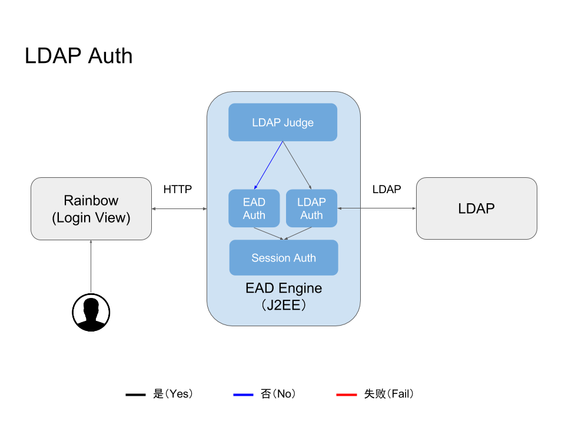

## 用户认证

LDAP 账号用户通过 EAD 平台登录界面登录时，EAD 平台将用户输入的账号和密码数据以 LDAP 协议的方式向 LDAP 发起认证请求，LDAP 认证服务处理完成后返回认证状态消息。EAD 根据 LDAP 接口返回的消息处理当前登录账号的 Session 状态或消息返回。

### LDAP 连接配置

- **协议：** LDAP
- **版本：** V3
- **编码：** UTF-8
- **LDAP URL：** 
- **BaseDN：** 

### 连接参数

参数名称|数据类型|说明|示例
--|--|--|--
SECURITY_PRINCIPAL|String|管理员|lli
SECURITY_CREDENTIALS|String|管理员密码|pass123

### 获取用户信息

参数名称|数据类型|说明|示例
--|--|--|--
uid|String|用户账号|lli

### 认证参数

参数名称|数据类型|说明|示例
--|--|--|--
SECURITY_PRINCIPAL|String|用户账号|lli
SECURITY_CREDENTIALS|String|账户密码|pass123

### 异常

异常类型|说明
--|--
AuthenticationException|认证失败
Exception|认证出错

