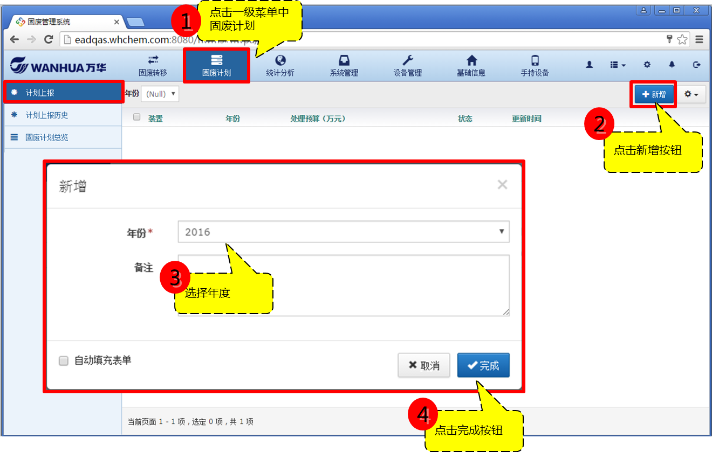
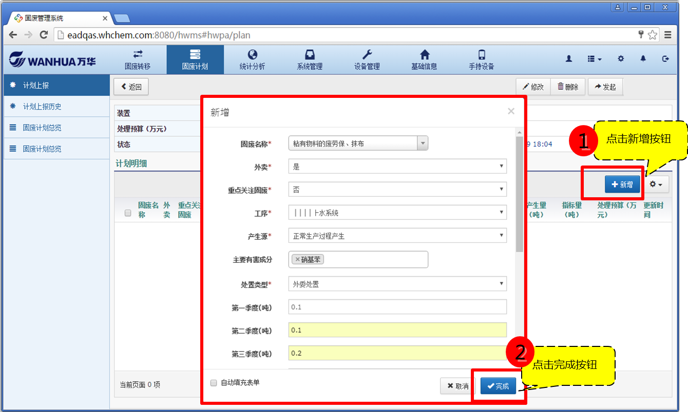
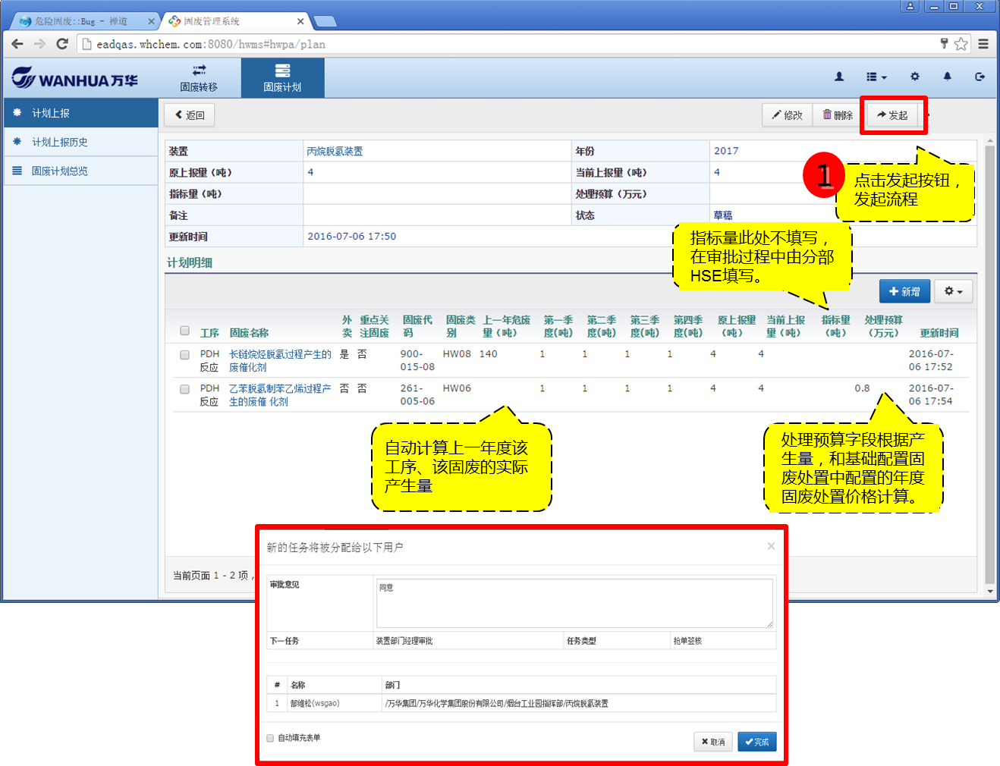
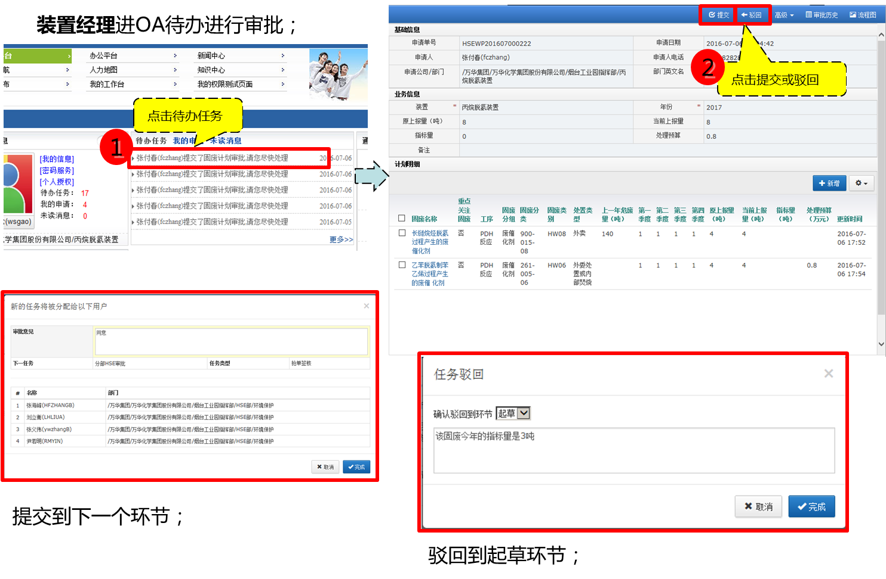
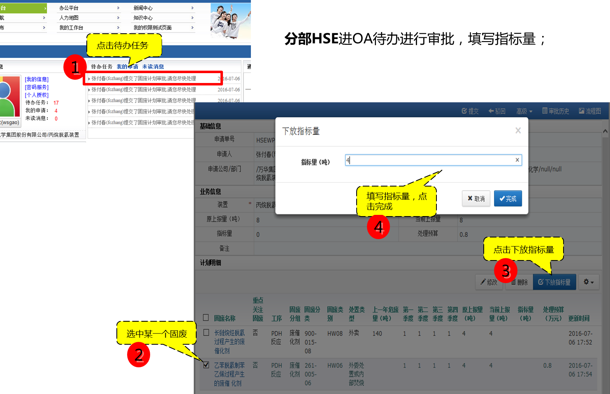

### 固废计划上报

* 以装置HSE工程师用户登录固废系统；

* 进入固废计划--》计划上报功能，点击新增按钮，填写年度固废计划表头，点击完成按钮；

* 进入计划明细，点击新增按钮，填写各工序固废产生明细；点击完成按钮；

* 回到计划上报详情或列表（选择某条计划）页面，点击发起审批流程，确认详情无误后，点击右上角'发起'，装置HSE工程师发起流程，弹出提示下一步审批人（装置经理）页面，点击完成按钮；

* 装置经理在OA我的工作台收到待办任务，进入待办任务，查看申请单，可提交（下一步审批人：分部HSE审批人）、驳回（至起草）、转办、加签；

* 分部HSE审批人在OA我的工作台收到待办任务，进入待办任务，查看申请单，可下放指标量，可提交（结束）、驳回（至起草）、转办、加签；

* 流程结束时，外卖部门收到通知消息。

